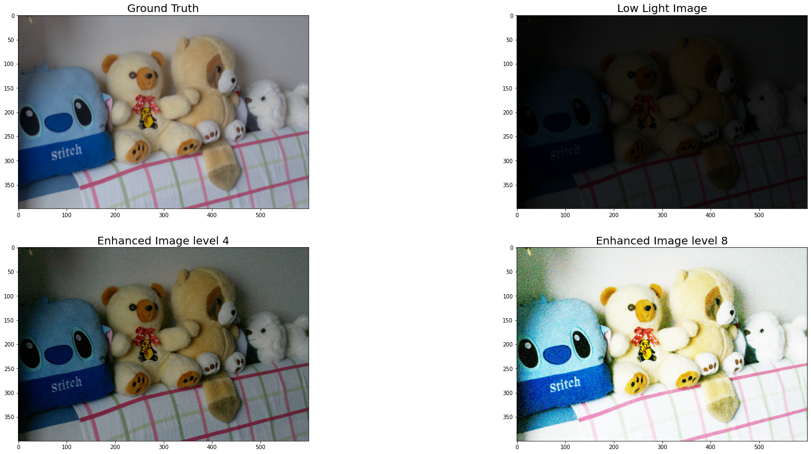
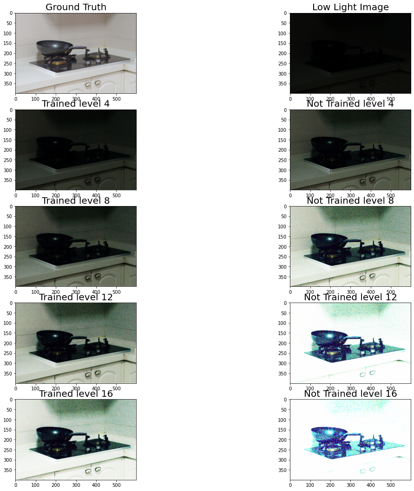

```
from google.colab import drive
drive.mount('/content/gdrive')
```

    Drive already mounted at /content/gdrive; to attempt to forcibly remount, call drive.mount("/content/gdrive", force_remount=True).
    


```
import numpy as np
import pandas as pd
import cv2
import imageio
import glob
import matplotlib.pyplot as plt
from tensorflow import keras
from tensorflow.keras import layers
from scipy import ndimage

from tensorflow.keras.models import load_model
```


```
Model = load_model(r'/content/gdrive/My Drive/ImageProcessing/Model_Zero-DCE_2.h5')
```


```
path = r'/content/gdrive/My Drive/LOLdataset/our485/high'

all_files = glob.glob(path + "/*.png")

high = list()

all_files.sort()

for fileName in all_files:
        
        
        img = imageio.imread(fileName)
        
            
        high.append(img)
        
        
high = np.array(high)


path = r'/content/gdrive/My Drive/LOLdataset/our485/low'

all_files = glob.glob(path + "/*.png")

all_files.sort()

low = list()

for fileName in all_files:
        
        
        img = imageio.imread(fileName)
        
            
        low.append(img)
        
low = np.array(low)

print(high.shape)
print(low.shape)
```

    (480, 400, 600, 3)
    (480, 400, 600, 3)
    


```
inputs = keras.Input(shape=(None, None, 3), name='img')

out1 = layers.Conv2D(32, (3,3), activation='relu', padding="same", strides=(1, 1))(inputs)

out2 = layers.Conv2D(32, (3,3), activation='relu', padding="same", strides=(1, 1))(out1)

out3 = layers.Conv2D(32, (3,3), activation='relu', padding="same", strides=(1, 1))(out2)

out4 = layers.Conv2D(32, (3,3), activation='relu', padding="same", strides=(1, 1))(out3)

in5 = layers.add([out3, out4])

out5 = layers.Conv2D(32, (3,3), activation='relu', padding="same", strides=(1, 1))(in5)

in6 = layers.add([out2, out5])

out6 = layers.Conv2D(32, (3,3), activation='relu', padding="same", strides=(1, 1))(in6)

in7 = layers.add([out1, out6])

outputs = layers.Conv2D(1, (3,3), activation='sigmoid', padding="same", strides=(1, 1))(in7)

model = keras.Model(inputs, outputs)

model.compile(optimizer="adam", loss='mean_squared_error')
model.summary()

```

    Model: "model_1"
    __________________________________________________________________________________________________
    Layer (type)                    Output Shape         Param #     Connected to                     
    ==================================================================================================
    img (InputLayer)                [(None, None, None,  0                                            
    __________________________________________________________________________________________________
    conv2d_7 (Conv2D)               (None, None, None, 3 896         img[0][0]                        
    __________________________________________________________________________________________________
    conv2d_8 (Conv2D)               (None, None, None, 3 9248        conv2d_7[0][0]                   
    __________________________________________________________________________________________________
    conv2d_9 (Conv2D)               (None, None, None, 3 9248        conv2d_8[0][0]                   
    __________________________________________________________________________________________________
    conv2d_10 (Conv2D)              (None, None, None, 3 9248        conv2d_9[0][0]                   
    __________________________________________________________________________________________________
    add_3 (Add)                     (None, None, None, 3 0           conv2d_9[0][0]                   
                                                                     conv2d_10[0][0]                  
    __________________________________________________________________________________________________
    conv2d_11 (Conv2D)              (None, None, None, 3 9248        add_3[0][0]                      
    __________________________________________________________________________________________________
    add_4 (Add)                     (None, None, None, 3 0           conv2d_8[0][0]                   
                                                                     conv2d_11[0][0]                  
    __________________________________________________________________________________________________
    conv2d_12 (Conv2D)              (None, None, None, 3 9248        add_4[0][0]                      
    __________________________________________________________________________________________________
    add_5 (Add)                     (None, None, None, 3 0           conv2d_7[0][0]                   
                                                                     conv2d_12[0][0]                  
    __________________________________________________________________________________________________
    conv2d_13 (Conv2D)              (None, None, None, 1 289         add_5[0][0]                      
    ==================================================================================================
    Total params: 47,425
    Trainable params: 47,425
    Non-trainable params: 0
    __________________________________________________________________________________________________
    


```
path = r'/content/gdrive/My Drive/ImageProcessing/DataSet/test'

all_files = glob.glob(path + "/*")

x = list()

all_files.sort()

for fileName in all_files:
        
        
        img = imageio.imread(fileName)
        
            
        x.append(img)
        
        
X = np.array(x)

print(X.shape)
```

    (8,)
    


```
def enhance(img, index, flag):
    if index == 0:
      return img

    elif flag == 1:
        h, w, c = img.shape
        test = model.predict(img.reshape(1, h, w, 3))
        temp = img / 255
        image = temp + ((test[0,:,:,:] * temp)*(1-temp))
        index = index - 1
        flag = 0
        return enhance(image, index, flag)

    else:
        h, w, c = img.shape
        temp = model.predict(img.reshape(1, h, w, 3))
        image = img + ((temp[0,:,:,:] * img)*(1-img))
        index = index - 1
        return enhance(image, index, flag)

```


```
e = 0
plt.figure(figsize=(30,30))

plt.subplot(4,2,1)
plt.title("Ground Truth",fontsize=20)
plt.imshow(high[e])

plt.subplot(4,2,2)
plt.title("Low Light Image",fontsize=20)
plt.imshow(low[e])

plt.subplot(4,2,3)
plt.title("Enhanced Image level 4",fontsize=20)
image4 = enhance(low[e], 4, 1)
plt.imshow(image4)

plt.subplot(4,2,4)
plt.title("Enhanced Image level 8",fontsize=20)
image8 = enhance(low[e], 8, 1)
plt.imshow(image8)
```


    <matplotlib.image.AxesImage at 0x7f1ffbbd4710>





```
def Enhance(img, index, flag):
    if index == 0:
      return img

    elif flag == 1:
        h, w, c = img.shape
        test = Model.predict(img.reshape(1, h, w, 3))
        temp = img / 255
        image = temp + ((test[0,:,:,:] * temp)*(1-temp))
        index = index - 1
        flag = 0
        return Enhance(image, index, flag)

    else:
        h, w, c = img.shape
        temp = Model.predict(img.reshape(1, h, w, 3))
        image = img + ((temp[0,:,:,:] * img)*(1-img))
        index = index - 1
        return Enhance(image, index, flag)
```


```
e = 473
IMAGE = low[e]
plt.figure(figsize=(30,30))

plt.subplot(8,3,1)
plt.title("Ground Truth",fontsize=20)
plt.imshow(high[e])

plt.subplot(8,3,2)
plt.title("Low Light Image",fontsize=20)
plt.imshow(IMAGE)


plt.subplot(8,3,4)
plt.title("Trained level 4",fontsize=20)
image4 = Enhance(IMAGE, 4, 1)
plt.imshow(image4)

plt.subplot(8,3,5)
plt.title("Not Trained level 4",fontsize=20)
image8 = enhance(IMAGE, 4, 1)
plt.imshow(image8)


plt.subplot(8,3,7)
plt.title("Trained level 8",fontsize=20)
image4 = Enhance(IMAGE, 8, 1)
plt.imshow(image4)

plt.subplot(8,3,8)
plt.title("Not Trained level 8",fontsize=20)
image8 = enhance(IMAGE, 8, 1)
plt.imshow(image8)

plt.subplot(8,3,10)
plt.title("Trained level 12",fontsize=20)
image4 = Enhance(IMAGE, 12, 1)
plt.imshow(image4)

plt.subplot(8,3,11)
plt.title("Not Trained level 12",fontsize=20)
image8 = enhance(IMAGE, 12, 1)
plt.imshow(image8)


plt.subplot(8,3,13)
plt.title("Trained level 16",fontsize=20)
image4 = Enhance(IMAGE, 16, 1)
plt.imshow(image4)

plt.subplot(8,3,14)
plt.title("Not Trained level 16",fontsize=20)
image8 = enhance(IMAGE, 16, 1)
plt.imshow(image8)

```


    <matplotlib.image.AxesImage at 0x7f2007443278>




