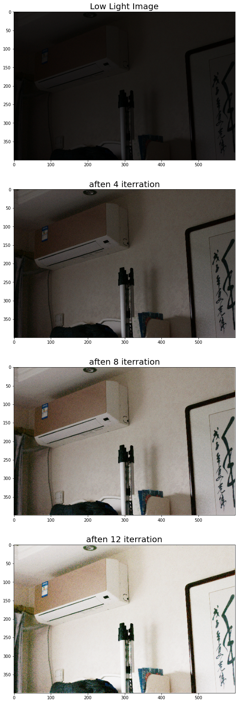
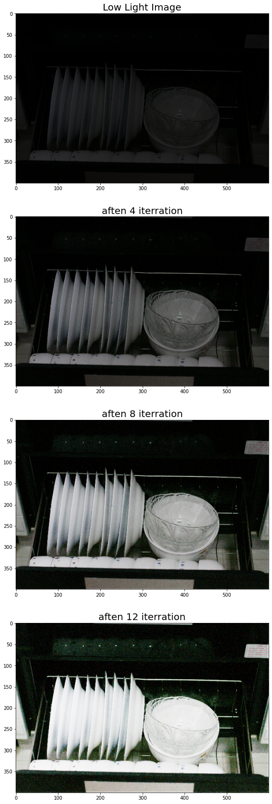
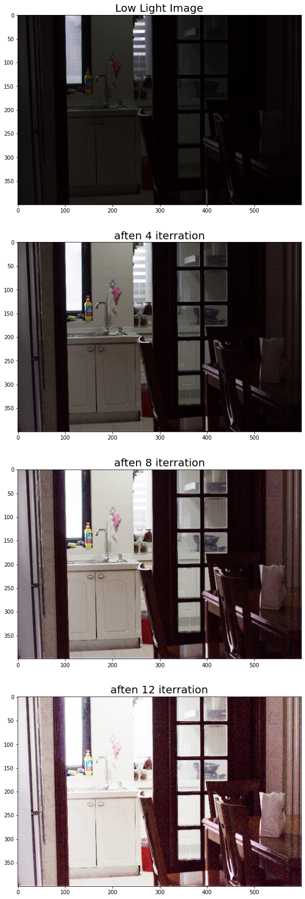
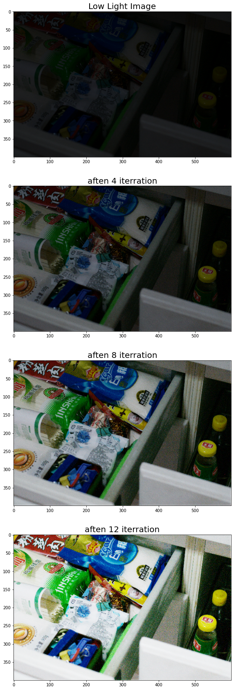
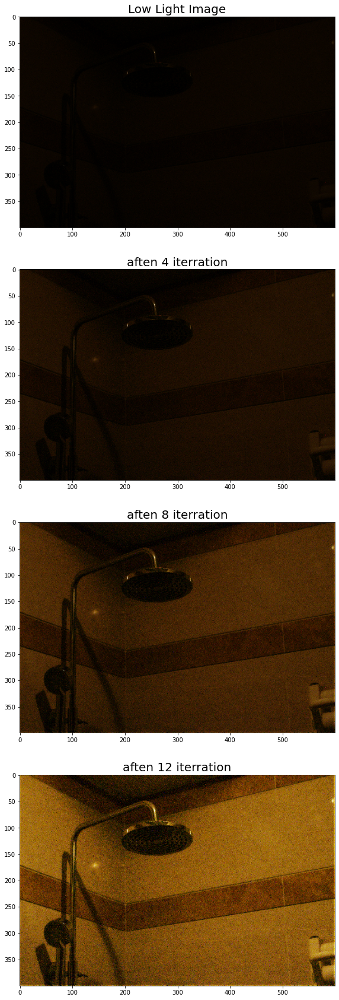

# **Processors Team**

---


```
from google.colab import drive
drive.mount('/content/gdrive')
```

    Go to this URL in a browser: https://accounts.google.com/o/oauth2/auth?client_id=947318989803-6bn6qk8qdgf4n4g3pfee6491hc0brc4i.apps.googleusercontent.com&redirect_uri=urn%3aietf%3awg%3aoauth%3a2.0%3aoob&response_type=code&scope=email%20https%3a%2f%2fwww.googleapis.com%2fauth%2fdocs.test%20https%3a%2f%2fwww.googleapis.com%2fauth%2fdrive%20https%3a%2f%2fwww.googleapis.com%2fauth%2fdrive.photos.readonly%20https%3a%2f%2fwww.googleapis.com%2fauth%2fpeopleapi.readonly
    
    Enter your authorization code:
    ··········
    Mounted at /content/gdrive
    


```
import numpy as np
import pandas as pd
import cv2
import imageio
import glob
import matplotlib.pyplot as plt
from scipy import ndimage
from tensorflow.keras.models import load_model
```


```
Model = load_model(r'/content/gdrive/My Drive/ImageProcessing/Model_Zero-DCE_2.h5')
```


```
path = r'/content/gdrive/My Drive/LOLdataset/our485/low'
all_files = glob.glob(path + "/*.png")
all_files.sort()
low = list()
for fileName in all_files:       
        img = imageio.imread(fileName)
        low.append(img)
        
low = np.array(low)

```


```
def Enhance(img, index, flag):
    if index == 0:
      return img

    elif flag == 1:
        h, w, c = img.shape
        test = Model.predict(img.reshape(1, h, w, 3))
        temp = img / 255
        image = temp + ((test[0,:,:,:] * temp)*(1-temp))
        index = index - 1
        flag = 0
        return Enhance(image, index, flag)

    else:
        h, w, c = img.shape
        temp = Model.predict(img.reshape(1, h, w, 3))
        image = img + ((temp[0,:,:,:] * img)*(1-img))
        index = index - 1
        return Enhance(image, index, flag)
```


```
IMAGE = low[30]
plt.figure(figsize=(30,30))

plt.subplot(4,1,1)
plt.title("Low Light Image",fontsize=20)
plt.imshow(IMAGE)

plt.subplot(4,1,2)
plt.title("aften 4 iterration",fontsize=20)
image4 = Enhance(IMAGE, 4, 1)
plt.imshow(image4)

plt.subplot(4,1,3)
plt.title("aften 8 iterration",fontsize=20)
image8 = Enhance(IMAGE, 8, 1)
plt.imshow(image8)

plt.subplot(4,1,4)
plt.title("aften 12 iterration",fontsize=20)
image12 = Enhance(IMAGE, 12, 1)
plt.imshow(image12)
```


    <matplotlib.image.AxesImage at 0x7f94f9e95c18>





```
IMAGE = low[1]
plt.figure(figsize=(30,30))

plt.subplot(4,1,1)
plt.title("Low Light Image",fontsize=20)
plt.imshow(IMAGE)

plt.subplot(4,1,2)
plt.title("aften 4 iterration",fontsize=20)
image4 = Enhance(IMAGE, 4, 1)
plt.imshow(image4)

plt.subplot(4,1,3)
plt.title("aften 8 iterration",fontsize=20)
image8 = Enhance(IMAGE, 8, 1)
plt.imshow(image8)

plt.subplot(4,1,4)
plt.title("aften 12 iterration",fontsize=20)
image12 = Enhance(IMAGE, 12, 1)
plt.imshow(image12)
```


    <matplotlib.image.AxesImage at 0x7f94fa60ceb8>





```
IMAGE = low[2]
plt.figure(figsize=(30,30))

plt.subplot(4,1,1)
plt.title("Low Light Image",fontsize=20)
plt.imshow(IMAGE)

plt.subplot(4,1,2)
plt.title("aften 4 iterration",fontsize=20)
image4 = Enhance(IMAGE, 4, 1)
plt.imshow(image4)

plt.subplot(4,1,3)
plt.title("aften 8 iterration",fontsize=20)
image8 = Enhance(IMAGE, 8, 1)
plt.imshow(image8)

plt.subplot(4,1,4)
plt.title("aften 12 iterration",fontsize=20)
image12 = Enhance(IMAGE, 12, 1)
plt.imshow(image12)
```


    <matplotlib.image.AxesImage at 0x7f94fa4699e8>





```
IMAGE = low[476]
plt.figure(figsize=(30,30))

plt.subplot(4,1,1)
plt.title("Low Light Image",fontsize=20)
plt.imshow(IMAGE)

plt.subplot(4,1,2)
plt.title("aften 4 iterration",fontsize=20)
image4 = Enhance(IMAGE, 4, 1)
plt.imshow(image4)

plt.subplot(4,1,3)
plt.title("aften 8 iterration",fontsize=20)
image8 = Enhance(IMAGE, 8, 1)
plt.imshow(image8)

plt.subplot(4,1,4)
plt.title("aften 12 iterration",fontsize=20)
image12 = Enhance(IMAGE, 12, 1)
plt.imshow(image12)
```


    <matplotlib.image.AxesImage at 0x7f94fc6a2780>





```
IMAGE = low[100]
plt.figure(figsize=(30,30))

plt.subplot(4,1,1)
plt.title("Low Light Image",fontsize=20)
plt.imshow(IMAGE)

plt.subplot(4,1,2)
plt.title("aften 4 iterration",fontsize=20)
image4 = Enhance(IMAGE, 4, 1)
plt.imshow(image4)

plt.subplot(4,1,3)
plt.title("aften 8 iterration",fontsize=20)
image8 = Enhance(IMAGE, 8, 1)
plt.imshow(image8)

plt.subplot(4,1,4)
plt.title("aften 12 iterration",fontsize=20)
image12 = Enhance(IMAGE, 12, 1)
plt.imshow(image12)
```


    <matplotlib.image.AxesImage at 0x7f94fa0277b8>




